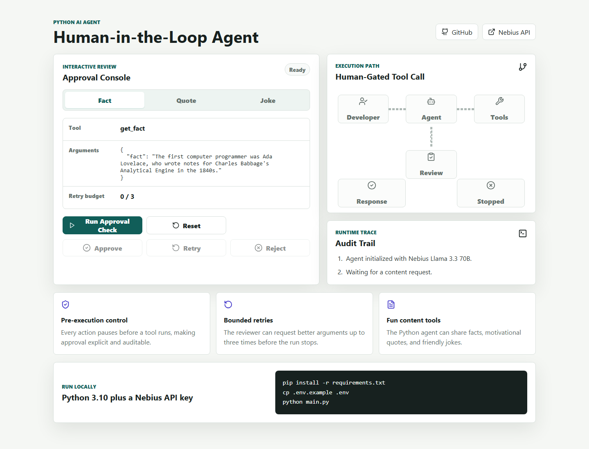

# Human-in-the-Loop Agent



A Python-based AI agent that demonstrates **human-in-the-loop control** for AI tool execution. The agent can share fun content such as facts, motivational quotes, and friendly jokes, but it must first pause and ask a human reviewer to approve, reject, or retry the proposed action.

This project is intentionally small, readable, and practical. It shows how an AI agent can keep a person in charge before anything is executed, which is one of the most important patterns for building safer agentic systems.

## Live Website

The published website includes an interactive approval simulator for the agent workflow:

**Website:** [https://tirth1263.github.io/human-in-the-loop-agent/](https://tirth1263.github.io/human-in-the-loop-agent/)

## What Is Human-in-the-Loop?

Human-in-the-loop (HITL) workflows add human judgment at important decision points inside an automated process. Instead of letting an agent immediately execute every tool call, the workflow pauses, shows the proposed action and arguments, and waits for a reviewer decision.

In this project, the reviewer can:

- Approve the proposed tool call.
- Reject the action and stop the run gracefully.
- Ask the model to retry with new data, up to three times.

## Features

- **Human verification:** Every action requires explicit approval before execution.
- **Pre-execution hooks:** Tool calls are intercepted before side effects can happen.
- **Retry mechanism:** A reviewer can request improved tool arguments up to three times.
- **Graceful cancellation:** Rejected actions stop the agent run cleanly.
- **Rich console UI:** The terminal shows the proposed action, arguments, retry count, and status messages.
- **Multiple content tools:** The agent can share interesting facts, motivational quotes, and friendly jokes.
- **Published web demo:** A React/Vite website demonstrates the approval flow in the browser.

## Tech Stack

- Python 3.10+
- [Agno](https://docs.agno.com/) for agent and tool orchestration
- [Nebius AI Studio](https://tokenfactory.nebius.com/) for the LLM API key
- `meta-llama/Llama-3.3-70B-Instruct` as the model
- Rich for the interactive terminal experience
- React, Vite, and TypeScript for the website

## How It Works

1. The agent receives the prompt: `Share something fun!`
2. The LLM decides whether to call `get_fact`, `get_quote`, or `get_joke`.
3. The pre-execution hook pauses the tool call.
4. The terminal shows the proposed action and arguments.
5. The human reviewer selects `y`, `n`, or `retry`.
6. Approved actions execute. Rejected actions stop. Retry requests ask the model for a new proposal.

## Project Structure

```text
.
├── main.py              # Python HITL agent
├── requirements.txt     # pip dependencies
├── pyproject.toml       # uv/project metadata
├── .env.example         # Nebius API key template
├── src/                 # React website source
├── index.html           # Vite entrypoint
├── package.json         # Website dependencies and scripts
└── docs/                # README website preview
```

## Prerequisites

- Python 3.10 or newer
- A Nebius API key from [tokenfactory.nebius.com](https://tokenfactory.nebius.com/)
- Node.js 20 or newer if you want to run or build the website locally

## Setup

Clone the repository:

```bash
git clone https://github.com/tirth1263/human-in-the-loop-agent.git
cd human-in-the-loop-agent
```

Install Python dependencies with pip:

```bash
pip install -r requirements.txt
```

Or install with uv:

```bash
uv sync
```

Create a `.env` file:

```bash
cp .env.example .env
```

Add your Nebius key:

```env
NEBIUS_API_KEY="your_nebius_api_key_here"
```

On Windows PowerShell, you can create the file with:

```powershell
Copy-Item .env.example .env
```

## Usage

Run the agent:

```bash
python main.py
```

The agent will present the proposed tool call and ask for approval:

- `y`: approve and execute the action
- `n`: reject and stop the agent run
- `retry`: ask the model to generate a new proposal

## Website Development

Install website dependencies:

```bash
npm install
```

Run the development server:

```bash
npm run dev
```

Create a production build:

```bash
npm run build
```

## Implementation Details

The agent uses Agno's `@tool(pre_hook=...)` pattern to intercept tool execution. The hook receives the pending `FunctionCall`, renders the proposed tool name and arguments with Rich, and then raises one of Agno's control exceptions when needed:

- `RetryAgentRun` gives feedback to the model and asks it to try again.
- `StopAgentRun` exits the tool loop gracefully after rejection or retry exhaustion.

The retry counter is bounded by `MAX_RETRIES = 3`, keeping the loop predictable and easy to audit.

## Error Handling

- Missing `NEBIUS_API_KEY` is detected before the agent starts.
- The retry limit prevents infinite review loops.
- Rejected tool calls stop without executing the selected tool.
- Clear terminal messages show the current decision and retry state.

## Reference

This project was created from the requested project description and inspired by the public example in [Arindam200/awesome-ai-apps](https://github.com/Arindam200/awesome-ai-apps/tree/main/simple_ai_agents/human_in_the_loop_agent). It also follows the Agno documentation for [tool hooks](https://docs.agno.com/tools/hooks), [RetryAgentRun](https://docs.agno.com/reference/tools/retry-agent-run), and [StopAgentRun](https://docs.agno.com/reference/tools/stop-agent-run).

## License

This project is released under the MIT License.
